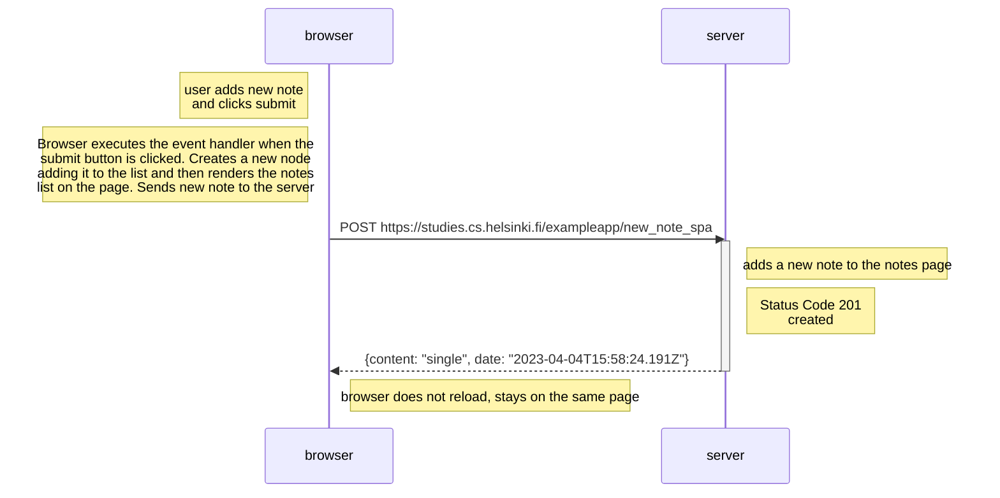

```mermaid
sequenceDiagram
    participant browser
    participant server

    Note left of browser: user adds new note<br>and clicks submit

    Note left of browser: Browser executes the event handler when the <br>submit button is clicked. Creates a new node <br>adding it to the list and then renders the notes <br>list on the page. Sends new note to the server
    browser->>server: POST https://studies.cs.helsinki.fi/exampleapp/new_note_spa
    activate server
    Note right of server: adds a new note to the notes page
    Note right of server: Status Code 201<br>created
    server-->>browser: {content: "single", date: "2023-04-04T15:58:24.191Z"}
    deactivate server
    Note right of browser: browser does not reload, stays on the same page

```
